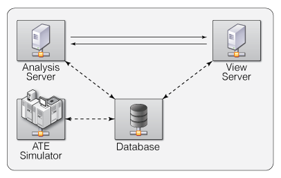

## Qikify Reference Spec

-----------------

__Version 1.0.0__

##### Description
This document provides a reference spec for the Qikify framework. Herein, we define roles for each "server" element in the system, communications protocols, and explain the implementations of each. This document is intended to be a evolutionary specification as work progresses on the individual components of the framework.

##### Architecture

##### Index
1. Analysis Server
2. ATE Simulator
3. View Server
4. Database
5. Client Browser

##### Changelog
- 1.0.0: Initial version.

### Analysis Server - __70% Complete__

##### Description
The analysis server is the first element of the system we have implemented, as documented in our IEEE Design & Test paper and various SRC presentations. Currently, the analysis server is written in 100% Python.

Input to the analysis server is currently in the form of CSV files. Eventually, the analysis server will request and load data directly from a database server into a `pandas.DataFrame`.

The atomic unit forming the basis of analysis server is its collection of _controllers_. Each controller is expected to operate on a `pandas.DataFrame` object (preferred) or possibly a `numpy.ndarray` via a `run()` class method. This `run()` class method is expected to process the dataset and return a result in the form of a `pandas.DataFrame`. Alternatively, the `run()` method may set class variables and provide accessor methods.

The expected use of the analysis server is running _flows_. A flow is a Python script defining a composition/sequence of controller operations to extract results from an input dataset, ultimately generating some result set to be sent back to the database server. Alternatively, the output data can be sent via ØMQ directly to the view server. 

##### Reference Implementation
In the Qikify framework, we specify a controller as a Python class using the following skeleton reference implementation:

	class Foo(object)
		def __init__(self):
			# If the controller has static variables, define them here.
			pass

		def run(self, X):
			# Run the controller action on input dataset X
			# ...
			return result

To implement a flow, consider an example case where we have a pair of framework controllers `Foo` and `Bar` that we intend to apply to an input dataset `indata`.

	from qikify.controllers.Foo import Foo
	from qikify.controllers.Bar import Bar
	import pandas
	
	indata = # obtain from database server

	X = pandas.DataFrame(indata)
	foo = Foo()
	bar = Bar(optionA = True, optionB = False)
	
	y = foo.run(X)
	Z = bar.run(X,y)
	
	# send result back to database here.

### ATE Simulator - __0% Complete__
The ATE simulator component of the Qikify framework is designed to support adaptive test simulations. As we do not have automated test equipment available in the lab, we use the ATE simulator to model a live production environment. This allows us to conduct experiments where the input data to the analysis server is a live stream instead of a static dataset. 

At present, the ATE simulator is designed to accept a CSV file and per-test timings; the simulator will then read off device lines from the CSV file and emit data via ØMQ over TCP as if it were testing the devices in realtime.

Eventually, this ATE simulator should handle multiprobe touchdowns and more sophisticated/accurate models of testers and test times. Progress on this simulator will likely be conditional on the quality of industrial ATE characterizations we can obtain.

### View Server - __5% Complete__
The view server is designed to present "views" of the MVC adaptive test system. The view server has two components, a front-end and a back-end. The front-end is responsible for presenting an HTML page with a collection of charts representing views. 

##### Front-end
Each front-end view is written in Coffeescript, a language that compiles to Javascript. A Cakefile is provided with the view server code that should be run in the background while developing with `cake watch`; this will ensure that any changes in front-end Coffeescript code will be instantaneously recompiled and minified to the Javascript served to connected clients. The front-end page is dynamically generated via interaction with the back-end via a live web sockets connection using [socket.io](http://socket.io) and [node.js](http://nodejs.org).

##### Reference Implementation
Although the API is undergoing heavy development and changing rapidly, the current reference implementation is for all views to subclass `Chart`. Eventually, a `ChartCollection` class will be made available to subclass, if the particular view needs to present a collection of charts rather than just one. A `Chart` object, when instantiated, creates a pair of UUIDs, one for itself and one for the chart canvas. The `Chart` object is a subclass of `DOMInteractions`, which provides an `inject(parentID, content)` method. Thus, placing a chart on the client's page can be done with:
	
    chart = new Chart('Title', 'Description.')
	chart.inject('#parent-id')
	chart.plot(data)

Future features:

1. Charts will be given dynamic controls, enabling the user to quickly drill down to subsets of the data.
2. Live server status icons should be presented here, showing the user the status of the database, analysis server, and view server.

##### Back-end
The back-end of the view server is a node.js server running socket.io. When a client connects to the view server, it retrieves the static HTML from a simple HTTP server and concurrently opens a web socket connection via socket.io to this node.js server, currently on port 8001.

The current architecture provide a single request-response protocol: the client requests a list of available datasets/views, and the server responds with that list. The client can then select an available view to render, and send a request for the corresponding data. The server will then respond with data in JSON.

This may presently be over-engineering. We intend to revisit the backend implementation in the future; web sockets may prove to be overkill for our needs and we can get by with a more simple jQuery AJAX implementation, using `$.get()` on the front end and Django on the back-end.

### Database - __0% Complete__
The database has yet to be designed. Ultimately, we need to be able to run queries against the available datasets, to obtain summary statistics as well as raw matrices of data. We are currently exploring options to implement this. A simple CSV datastore would be the easiest option, and is currently how our system works. However, this does not support elegantly storing summary statistics or running queries against the data.

MySQL is another option, and provides the means of storing summary statistics in tables, along with the ability to run SQL queries agains the data. However, this has the distinct disadvantage of not supporting a large number of columns, and needing to explicitly specify data types for every column. Given that our data comes with many thousands of columns and many data types, this seems like a mismatch.

We are going to explore implementing the database using MongoDB. MongoDB appears to meet all of our criteria for speed, queryability, summary statistic storage, and high numbers of columns without explicit typing.

